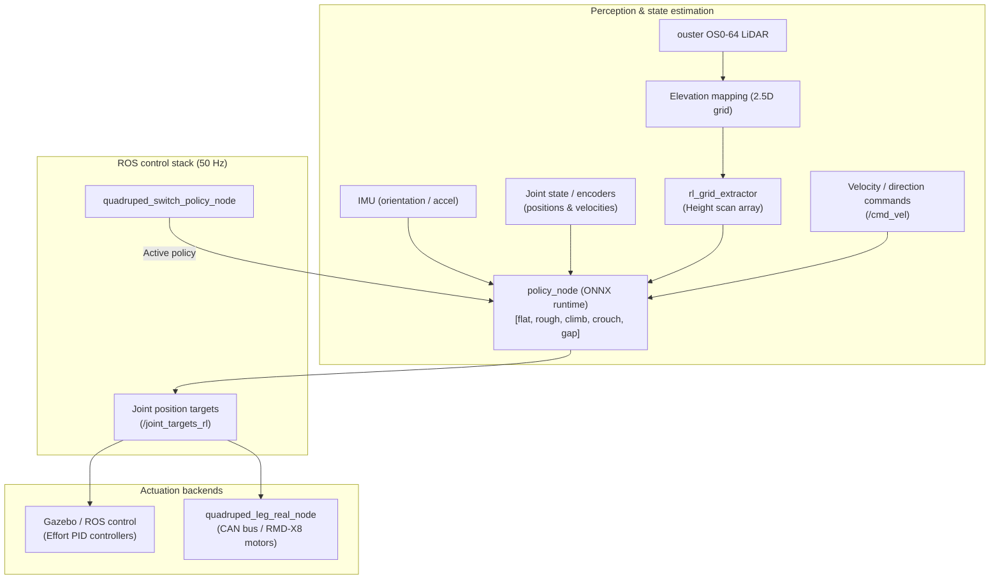

# User Manual
ContinuO is an advanced quadruped robot designed for search and rescue operations across structured and unstructured terrains. The control stack combines Reinforcement Learning (RL) policies trained in NVIDIA Isaac Sim / Isaac Lab, exported to ONNX, and executed in real-time within ROS (Noetic) on both simulated (Gazebo) and physical platforms.

## 1 Kinematics & joint (14 DOFs)
The robot features 14 controllable degrees of freedom ordered as:
["FL_HAA", "FR_HAA", "HL_HAA", "HR_HAA", "FL_HFE", "FR_HFE", "HL_HFE", "HR_HFE", "FL_KFE", "FR_KFE", "HL_KFE", "HR_KFE", "HL_AFE", "HR_AFE"]

- Front Legs (6 DOFs): Hip Abduction/Adduction (HAA), Hip Flexion/Extension (HFE), Knee Flexion/Extension
(KFE).
- Hind Legs (8 DOFs): Hip Abduction/Adduction (HAA), Hip Flexion/Extension (HFE), Knee Flexion/Extension
(KFE), Ankle Flexion/Extension (AFE).
- Default angles (q₀ in radians):
  - Front legs: HAA = 0.0, HFE = 0.4102, KFE = -1.2716
  - Hind legs: HAA = 0.0, HFE = -0.6981, KFE = 1.6760, AFE = -1.7219
- Joint action Scaling: 0.5

---

## 2. Environment setup
The project is pre-configured inside a Docker container running **ROS Noetic** 

### 2.1 Build the Docker image
`cd /home/josch/Projects/Continuo/joschka
docker build -t ros_ouster_sync .`

### 2.2 Grant X11 display permissions for GUI/RViz/Gazebo
`xhost +local:root
export LIBGL_ALWAYS_SOFTWARE=1`

### 2.3 Run the container with host networking and hardware device passthrough
`docker run -it --net=host --ipc=host \
  --env="DISPLAY=$DISPLAY" \
  --volume="/tmp/.X11-unix:/tmp/.X11-unix:rw" \
  -v /dev:/dev --privileged \
  -v /home/josch/Projects/Continuo:/root/catkin_ws/src/continuo \
  --name ros_ouster_sync ros_ouster_sync bash`

### 2.4 Starting / Entering an Existing Container
* **Start container:** `docker start -i ros_ouster_sync`
* **Open another shell:** `docker exec -it ros_ouster_sync bash`
* **Stop container:** `docker stop ros_ouster_sync`

> [!WARNING]
> Always connect USB **before** starting the container

### 2.5 Building the catkin workspace

Inside your ROS workspace:
`cd ~/catkin_ws
catkin_make -DCMAKE_BUILD_TYPE=Release
source devel/setup.bash`

## 3. Gazebo + RL
### 3.1 All-in-one simulation bringup
To launch Gazebo, the robot controllers, TF publishers, elevation mapping, and the ONNX policy runner in
one command:

`roslaunch mitacs florant_bringup.launch`

### 3.2 Modular Step-by-Step Launch
If debugging individual components:

1. Launch Gazebo World:
`roslaunch f_quadruped_control gazebo.launch`

2. Spawn Robot & Start PID Controllers:
`roslaunch f_quadruped_control spawn_control.launch`

3. Start TF & Elevation Mapping:
`rosrun mitacs odom_to_tf.py
roslaunch mitacs elevation_mapping.launch
rosrun mitacs rl_grid_extractor.py`

4. Start ONNX Policy Engine:
`rosrun f_quadruped_control policy_node.py
rosrun f_quadruped_control policy_to_controllers.py`

### 3.3 Dynamic policy switching & sending commands
--- NOT YET IMPLEMENTED ---
The robot supports dynamic switching between pre-trained ONNX policies:

#### Switch active policy (flat, rough, climb, crouch, gap, narrow)
--- NOT YET IMPLEMENTED ---
`rostopic pub /policy_name std_msgs/String "data: 'rough'" --once`

#### Send forward/angular velocity commands
`rostopic pub /cmd_vel geometry_msgs/Twist "linear: {x: 0.4, y: 0.0, z: 0.0} angular: {x: 0.0, y: 0.0, z:0.0}" -r 10`

## 4. ActuatorNet: Actuator sim-to-real calibration
An ActuatorNet is a neural netwok that models real torque response in sim.

Inputs (History = 6 steps × 3 features = 18 values): [pos_error (target - actual), joint_velocity, joint_position]
Output: [motor_current (Amperes) / torque]

### 4.1 Training actuatorNet
`cd /home/josch/Projects/Continuo/actuator_net
python3 train_actuator_net.py`

- Best model configuration: GELU_128*4_learn_0.0005_batch_128 (achieving R² ≈ 0.787 and RMSE 1.348 A vs 6.2 A with a default PD controller).
- Weights and test graphs are saved under saved folder.

## 5. Pre-Trained RL Policies Reference
Configured in policies.yaml:
Policy mame  | ONNX model file                 | Observation dim | Terrain / function
--------------|---------------------------------|-----------------|----------------------------------------
flat         | flat_pushing_pt2.onnx           | 56              | Flat ground locomotion, push recovery
rough        | rough_fixed-slope-2.onnx        | 243             | Slopes, uneven ground, small obstacles
climb        | climb_final-climb.onnx          | 243             | Step climbing, curbs
crouch       | crouch-heading-corrected-2.onnx | 244             | Low ceiling clearance / crouching
gap          | gap_final-gap-2.onnx            | 397             | Ditch / gap crossing
narrow       | narrow-full-success.onnx        | 243             | Confined corridors and narrow pathways

## 6. Diagnostics, tuning & analysis utilities
The helper folder contains specialized tools:
Script                               | Purpose
--------------------------------------|--------------------------------------------------------------------
manual_joint_tuner.py                | Interactive GUI/CLI to move individual joints and inspect response
stance_tuner.py                      | Tunes standing posture PID gains without falling
pid_analyzer.py                      | Computes RMSE, rise time, and overshoot from joint logs
replay_policy.py                     | Replays recorded joint trajectory CSV files
lidar_recorder.py                    | Records and checks LiDAR point velocity and filter noise

To run any helper script:
`python3 /home/josch/Projects/Continuo/joschka/scripts/helper/XXX.py`
